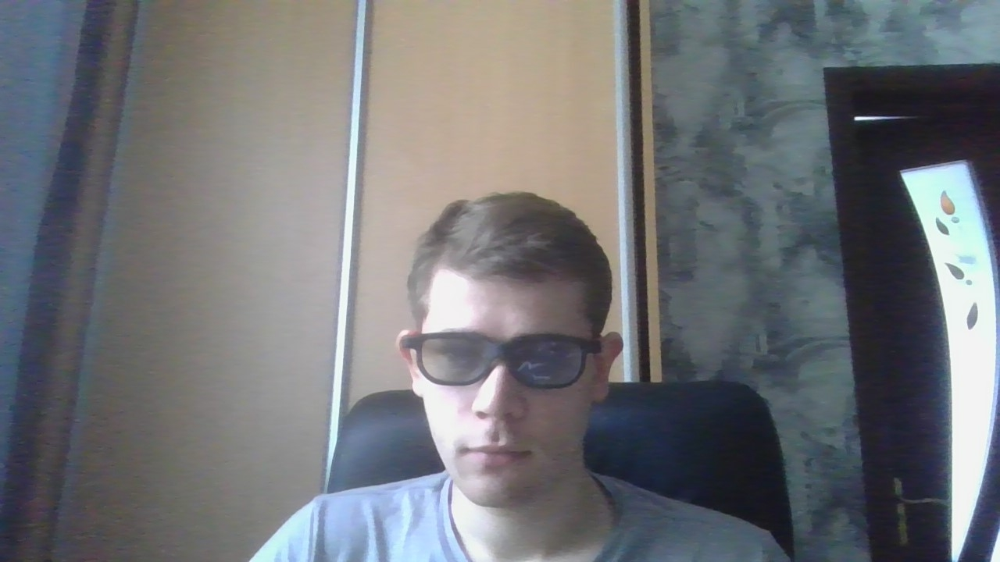

# WebGL

1.In polarized glasses I saw my figure with the effect of depth
2.Binocular disparity was achieved by the difference in the location of the object seen by the left and right eyes, which provides depth perception in human vision.
(Left and right coordinates).
3.The branch name was renamed.

Project that accompanies VGGI credit module.

Visit vggi-kpi.blogspot.com for more information

